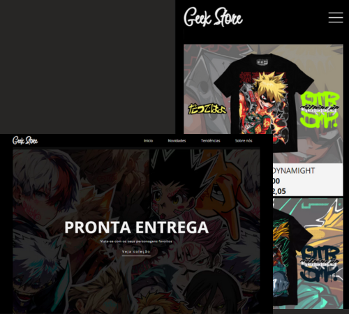

# Geek Store! - um exemplo de página principal para uma loja virtual 

  

  <a href="#-tecnologias">Tecnologias</a>&nbsp;&nbsp;&nbsp;|&nbsp;&nbsp;&nbsp;
  <a href="#projeto">Projeto</a>&nbsp;&nbsp;&nbsp;|&nbsp;&nbsp;&nbsp;
  <a href="#desafio">Desafio</a>&nbsp;&nbsp;&nbsp;|&nbsp;&nbsp;&nbsp;
  <a href="#O-que-aprendi">O que aprendi</a>&nbsp;&nbsp;&nbsp;&nbsp;&nbsp;&nbsp;

## 🚀 Tecnologias

Esse projeto foi desenvolvido com as seguintes tecnologias:

- HTML e CSS
- JavaScript
- Git e Github

## Projeto

A GeekStore é uma loja virtual com foco em roupas de séries, animes, filmes e tudo envolvendo a cultura Geek. Seu projeto foi feito a partir de um exercicio proposto pelo curso full-stack com python da EBAC, sendo a principal referência de seu layout a loja virtual dattebayosupply.

## Desafio

Como parte de um exercicio, o desenvolvedor deve ser capaz de:

- Criar um layout responsivo de uma loja virtual
- Criar uma seção “sobre a loja”, nesta seção teremos
duas colunas uma com a imagem da loja e outra com
um texto
- Criar uma seção de produtos onde haverá uma listagem
de 4 produtos, lado a lado, com a imagem, nome e
descrição do produto e um botão para adicionar ao
carrinho

Veja o resultado através do <a href="https://geek-store-main-page.vercel.app/">link do Vercel</a>

## O que aprendi

Com o objetivo de treinar a responsividade nos layouts da pagina, este projeto me ajudou a desenvolver as seguintes habilidades:

- Layouts responsivos utilizando media querys
- Responsividade com valores do viewport e REM
